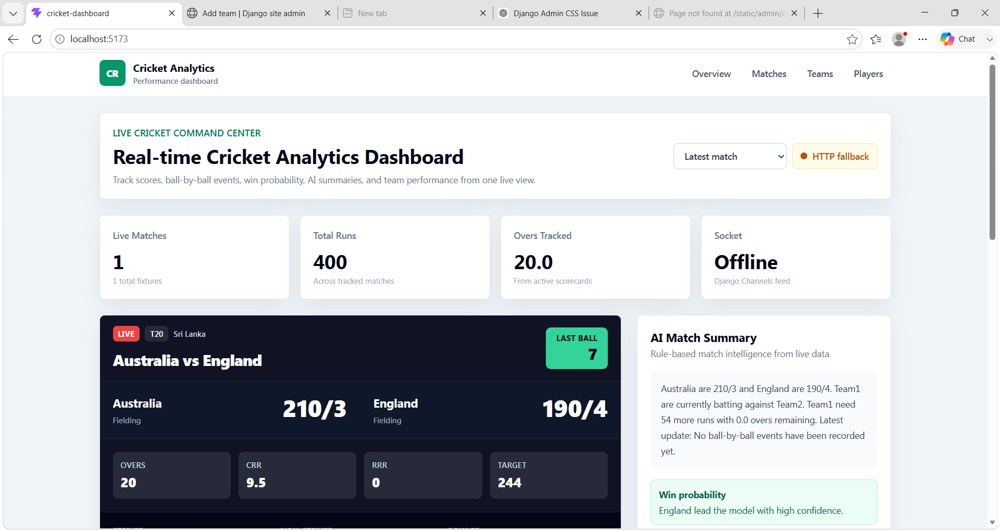
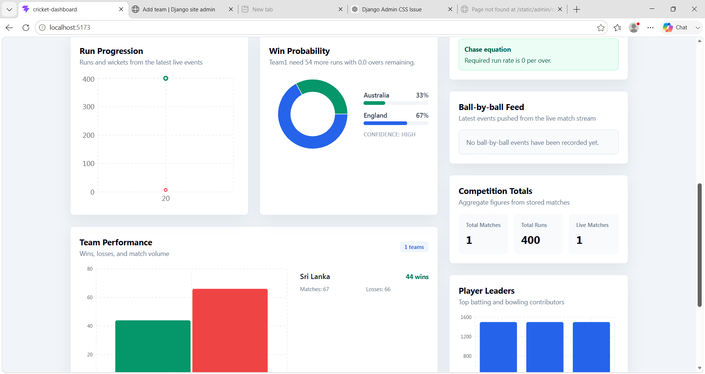

# Cricket Analytics Dashboard – Deployment Guide

## Project Structure
```
Cricket_project/
  cricket-dashboard/    ← React + Vite frontend
  cricket_backend/      ← Django + DRF + Channels backend
```

---

## Backend Setup (Django)

```bash
cd cricket_backend

# Create and activate virtual environment
python -m venv venv
# Windows:
venv\Scripts\activate
# Mac/Linux:
source venv/bin/activate

# Install dependencies
pip install django djangorestframework django-cors-headers channels daphne

# Run migrations
python manage.py migrate

# Create admin user (optional)
python manage.py createsuperuser

# Start backend server (IMPORTANT: use daphne for WebSocket support)
daphne -p 8000 cricket_backend.asgi:application
```

> **Note:** Use `daphne` instead of `python manage.py runserver` because the project uses Django Channels (WebSockets).

---

## Frontend Setup (React)

```bash
cd cricket-dashboard

# Install dependencies
npm install

# Start dev server (auto-proxies /api/ to Django on port 8000)
npm run dev

# Build for production
npm run build
```

---

## Quick Start (Development)

Open two terminals:

**Terminal 1 – Backend:**
```bash
cd cricket_backend
source venv/bin/activate
daphne -p 8000 cricket_backend.asgi:application
```

**Terminal 2 – Frontend:**
```bash
cd cricket-dashboard
npm run dev
```

Then open: http://localhost:5173

---

## Add Sample Data

```bash
cd cricket_backend
python manage.py shell
```

```python
from cricket.models import Match, Player, Team

# Create teams
t1 = Team.objects.create(name="India", matches_played=3, wins=2, losses=1)
t2 = Team.objects.create(name="Australia", matches_played=3, wins=1, losses=2)

# Create a live match
Match.objects.create(
    team1="India", team2="Australia",
    team1_score=145, team2_score=112,
    team1_wickets=3, team2_wickets=5,
    overs=15.2, status="live",
    match_format="T20",
    batting_team="India",
    venue="MCG, Melbourne",
    current_batter="Rohit Sharma",
    current_bowler="Mitchell Starc",
)

# Create players
Player.objects.create(name="Rohit Sharma", team="India", runs=450, wickets=0)
Player.objects.create(name="Virat Kohli", team="India", runs=380, wickets=0)
Player.objects.create(name="Mitchell Starc", team="Australia", runs=20, wickets=12)
```

---

## Bugs Fixed

1. **`MatchList.jsx`** – Was completely empty; now renders match cards.
2. **`StatsCard.jsx`** – Was completely empty; now a reusable stat card component.
3. **`settings.py`** – `ALLOWED_HOSTS = []` blocked all requests; changed to `["*"]` for dev.
4. **`consumers.py`** – Imported sync `dashboard_payload()` from views which caused Django ORM async errors; refactored to use `@database_sync_to_async` properly.
5. **`settings.py`** – Missing `DEFAULT_AUTO_FIELD` caused Django warnings; added it.


## Screenshots

### dashboard



### Admin page


